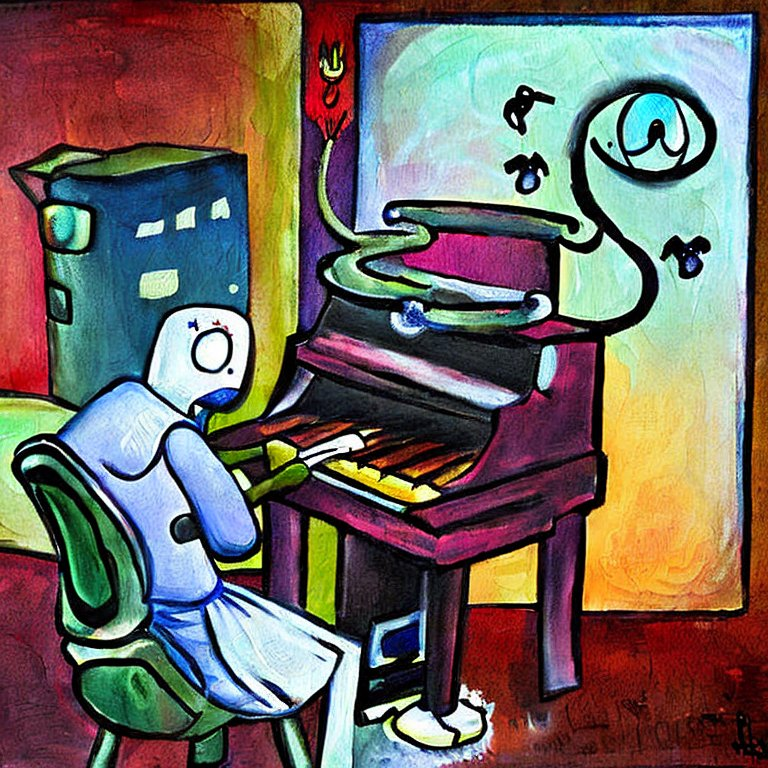

# counterpoint



A masked sequence model for harmonisation in the style of J.S. Bach. Inspired by other work (1, 2, 3), this model uses a transformer encoder to harmonize incomplete piano-rolls in the style of Bach.

The model can be trained on two datasets which are both located in ```data/raw```. The first dataset ```chorale16sep.json``` is taken directly from (4). It comprises of Bach's four part chorales (quantised into 16th notes) as MIDI-note piano-rolls. I built the second dataset ```fugue16sep.json``` (resp. ```fugue32sep.json``` ) starting from (5). This dataset comprises of Bach's fugues from the WTC (book 1 & 2) separated into 4 voices and quantised into 16th (resp. 32nd) note MIDI piano-rolls. All the data processing can be found in the ```src``` directory. The raw LilyPond and MIDI files I used to build this dataset from can be found in ```data/raw/fugue```.

The model uses masking and gibbs sampling in the same way as described in (1). When only trained on the JSBChorales dataset, the model has a similar sample quality to Google Magenta's [Coconet](https://magenta.tensorflow.org/coconet). Samples (MIDI and some MP3 files) can be found in ```samples```, please note the model, dataset, and sampling procedure is still a work in progress.

### Installation

I recommend you create your own environment if you want to try it out yourself. Entering the following commands should install the repo correctly on Linux machines. If you want to use CUDA, please make sure the correct graphics drivers and (CUDA-enabled) PyTorch version are installed. If this is done, the model should use your GPU automatically.

```
git clone https://github.com/loua19/counterpoint
cd counterpoint
conda create --name counterpoint python
conda activate counterpoint
conda install pytorch torchvision torchaudio cpuonly -c pytorch
pip install mido
pip install MIDIUtil
pip install progress
```

### Usage

If you want access to the pre-trained parameters, message me and I'll send you a download link (~150mb file). Otherwise, you may train the model yourself by executing the command: 
```
python run.py train -p params.txt
```
Once you have the parameters, you may sample from the model by executing the command:

```
python run.py sample -p fugue_params.txt -s data/output
```

Note that the current iteration of the model has ~30m parameters. As such, training and sampling may fail if your machine doesn't have enough RAM/VRAM. The model was trained and sampled on a Tesla V100 16GB.

### References

1. Huang, C.-Z. A., Cooijmans, T., Roberts, A., Courville, A., & Eck, D. (2019). Counterpoint by Convolution.

2. Huang, C.-Z. A., Vaswani, A., Uszkoreit, J., Shazeer, N., Simon, I., Hawthorne, C., Dai, A. M., Hoffman, M. D., Dinculescu, M., & Eck, D. (2018). Music Transformer.

3. Devlin, J., Chang, M.-W., Lee, K., & Toutanova, K. (2018). BERT: Pre-training of Deep Bidirectional Transformers for Language Understanding.

4. https://github.com/czhuang/JSB-Chorales-dataset

5. Rother, K. 2015. An 'open source' open score edition of Bach's Well-tempered Clavier. Music score. University of Cape Town.
